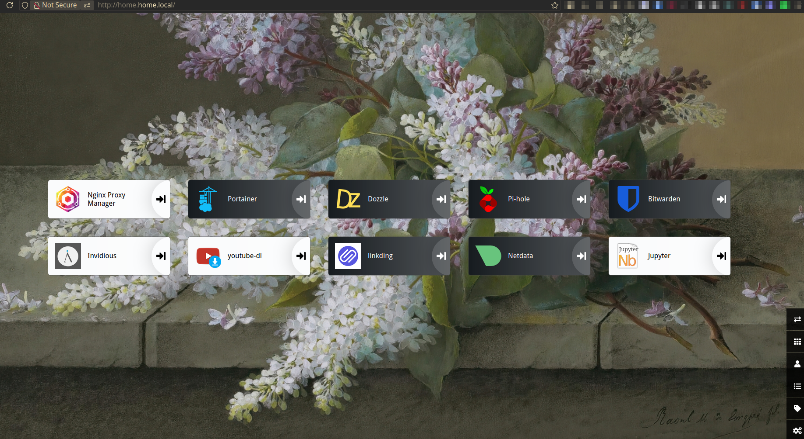

# 📦 Home Docker Environment

This repository contains individual Docker service configurations, each in its own folder with a `docker-compose.yml` file. It's intended to help manage and deploy a suite of self-hosted tools via Docker Compose.

---

## 🚀 Script Overview

### `start_all.sh`

This script automatically starts all Docker services

#### ✅ How It Works:

```bash
./start_all.sh
```


---
## 🐳 Docker Services

### 📂 `bitwarden`
Self-hosted password manager. Securely stores credentials, notes, and other sensitive data.

### 📂 `dozzle`
Real-time log viewer for Docker containers via a web interface.

### 📂 `heimdall`
A beautiful dashboard to organize and access your self-hosted services.

### 📂 `linkding`
Minimal, self-hosted bookmark manager. Fast, simple, and great for organizing links.

### 📂 `metube`
Web UI for downloading YouTube and other videos using `yt-dlp`.

### 📂 `netdata`
Real-time monitoring for your systems and containers with rich visualizations.

### 📂 `nginx-proxy-manager`
Web-based interface for managing NGINX reverse proxy and Let's Encrypt SSL certificates.

### 📂 `pihole`
Network-wide ad blocker acting as a DNS sinkhole to block unwanted content.

### 📂 `portainer`
Graphical management interface for Docker environments, including containers, images, and networks.
